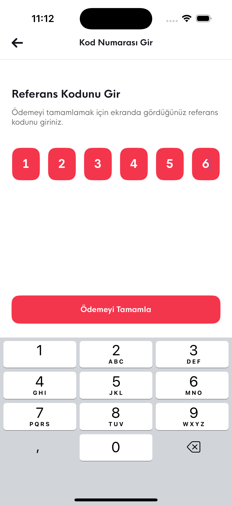

# Macellan Case Study Çözümü

### Kullanılan Teknolojiler

- **Frontend**: [
  React Native,
  Expo,
  TypeScript,
  Redux Toolkit,
  RTK Query,
  Styled Components
  ]

- **Diğer Araçlar**: [
  Reactotron DevTools
  ]

### Proje Yapısı

src/
├── assets/
├── components/
│ └── common/
├── contexts/
├── devtools/
├── hooks/
├── mocks/
├── navigation/
├── redux/
├── screens/
│ └── components/
├── services/
├── theme/
├── types/
└── utils/

### Kurulum Adımları

1. Yarn veya npm ile bağımlılıkları yükleyin. (Yarn kullandığım için onu öneriyorum tercihen.)

2. Yarn ios veya yarn android ile projeyi ayaklandıralım (NOT: Expo-Font prebuildde görünüyor Expo Go halinde görünmeyecek.)

## 📸 Ekran Görüntüleri

   
   
   
   
   
   
   
   

## 📸 Test Akış Senaryosu Test Videosu

https://drive.google.com/file/d/1LbxdDjYFg9cO6qx0mQkG6jqadlKw97YM/view?usp=share_link
